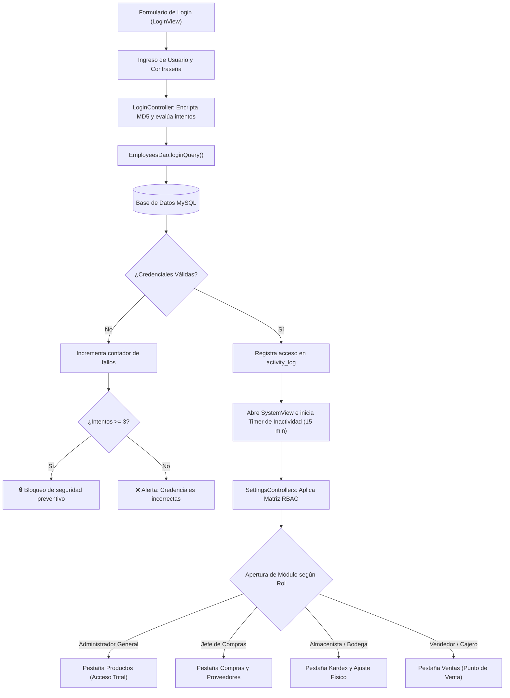
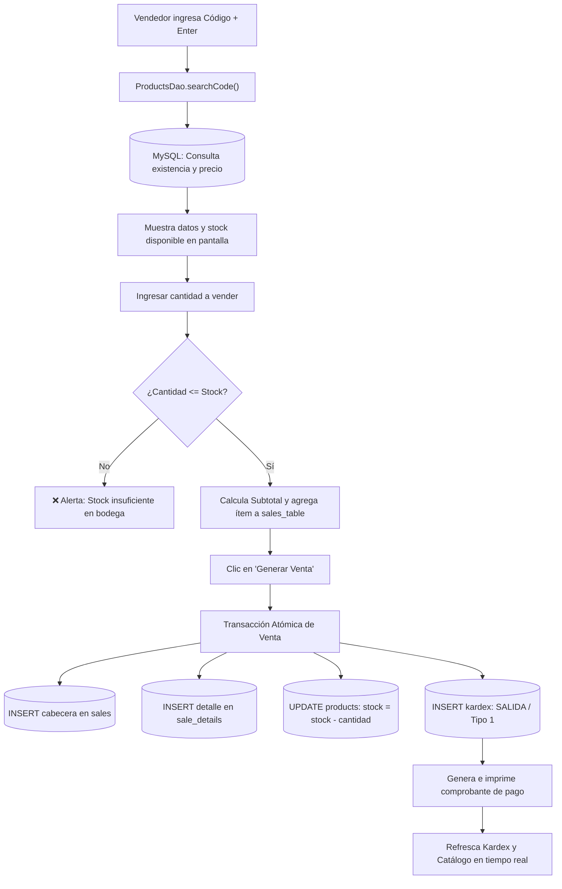
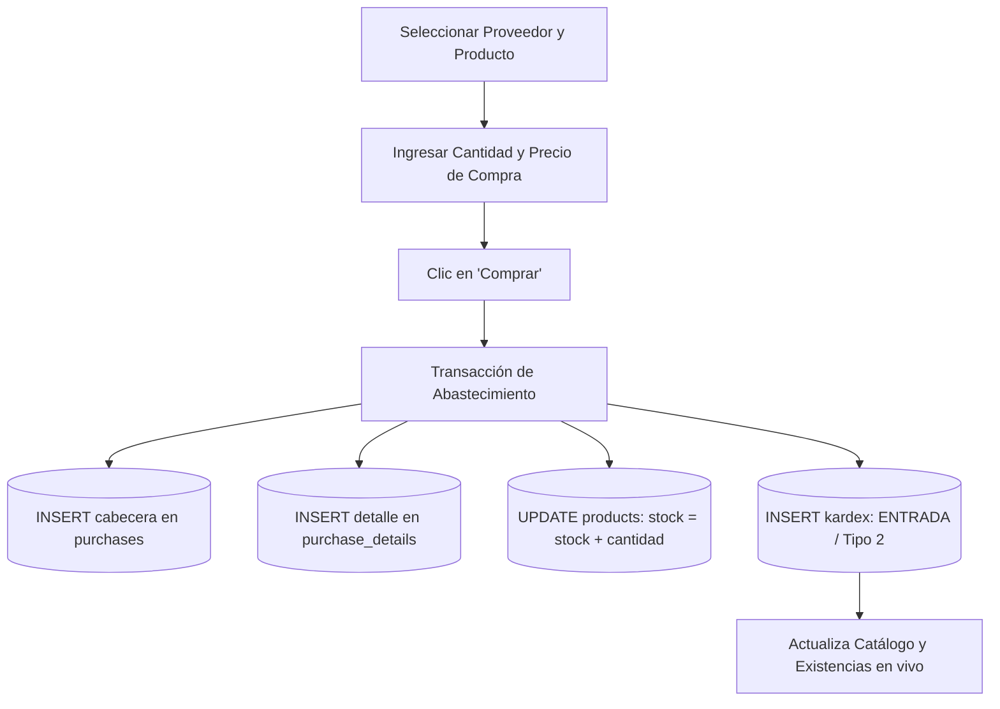
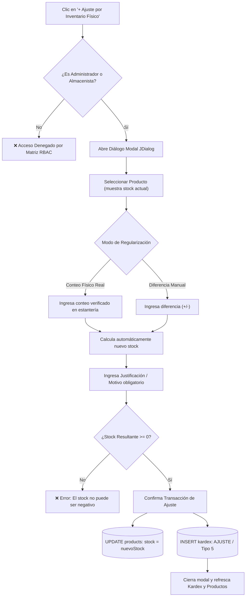

# 🎮 Tienda Gamer - Sistema de Gestión de Inventarios y Ventas


Sistema integral de escritorio para la administración operativa, comercial y de inventarios de una tienda especializada en tecnología y videojuegos (**Tienda Gamer**). Desarrollado bajo el patrón arquitectónico **Modelo - Vista - Controlador (MVC)**, con interfaz moderna basada en **FlatLaf**, base de datos relacional **MySQL** y control de acceso estricto basado en roles (**RBAC**).

---

## 📋 Tabla de Contenidos
1. [Características Principales](#-características-principales)
2. [Matriz de Control de Acceso (RBAC)](#-matriz-de-control-de-acceso-rbac)
3. [Módulos del Sistema](#-módulos-del-sistema)
4. [Diagramas y Flujos Operativos](#-diagramas-y-flujos-operativos)
5. [Conceptos Técnicos Clave](#-conceptos-técnicos-clave)
6. [Requisitos del Sistema](#-requisitos-del-sistema)
7. [Instalación y Puesta en Marcha](#-instalación-y-puesta-en-marcha)
8. [Credenciales de Prueba](#-credenciales-de-prueba)
9. [Estructura del Proyecto](#-estructura-del-proyecto)
10. [Buenas Prácticas y Seguridad](#-buenas-prácticas-y-seguridad)
11. [Entregables del Proyecto](#-entregables-del-proyecto)

---

## 🚀 Características Principales

* **Control de Acceso Basado en Roles (RBAC)**: Matriz de 4 perfiles oficiales que restringe vistas y acciones sensibles (ventas, compras, catálogo y nómina).
* **Control de Inventario Permanente (Kardex)**: Registro histórico y auditable de cada entrada, salida y regularización de existencias en bodega, con cálculo automático de saldos anteriores y resultantes.
* **Ajustes por Inventario Físico**: Ventana modal interactiva para regularizar descuadres detectados en conteos reales de bodega (por unidades dañadas, mermas o sobrantes), con justificación obligatoria.
* **Punto de Venta y Facturación**: Registro de ventas con cálculo automático de subtotales, impuestos, descuento de existencias en tiempo real e impresión de comprobante.
* **Gestión de Compras y Devoluciones**: Registro de compras con entrada al Kardex y anulación de compras con devolución registrada a proveedores.
* **Gestión de Nómina y Sueldos**: Control de salarios con modificación autorizada exclusivamente para el Administrador General y reporte consolidado de nómina.
* **Diseño Gamer Moderno**: Interfaz con paleta Slate Gamer (`#181826`), selector de Tema Claro / Oscuro en tiempo real, bloqueo de arrastre accidental de columnas y avatares dinámicos en cabecera.
* **Seguridad y Auditoría**: Encriptación de contraseñas con MD5, registro de eventos en `activity_log`, cierre automático de sesión por inactividad (15 min) y desacople de credenciales en `db.properties`.

---

## 🛡️ Matriz de Control de Acceso (RBAC)

El sistema implementa formalmente la matriz de privilegios y perfiles definida para la empresa (conforme a la **Figura 2 / Página 11** de la documentación técnica):

| Módulo / Funcionalidad | Gerente / Administrador | Jefe de Compras | Almacenista / Bodega | Vendedor / Cajero |
| :--- | :---: | :---: | :---: | :---: |
| **Punto de Venta (Ventas)** | ✅ Total | ❌ Restringido | ❌ Restringido | ✅ Total |
| **Clientes** | ✅ Total | ❌ Restringido | ❌ Restringido | ✅ Total |
| **Compras y Detalle** | ✅ Total | ✅ Total | ✅ Recepción | ❌ Restringido |
| **Proveedores** | ✅ Total | ✅ Total | ❌ Restringido | ❌ Restringido |
| **Catálogo de Productos** | ✅ Crear/Editar/Eliminar | 👁️ Solo Consulta | 👁️ Solo Consulta | 👁️ Solo Consulta |
| **Kardex (Trazabilidad)** | ✅ Total | ❌ Restringido | ✅ Total | ❌ Restringido |
| **Ajustes de Inventario Físico** | ✅ Autorizado | ❌ Restringido | ✅ Autorizado | ❌ Restringido |
| **Empleados y Salarios** | ✅ Total | ❌ Restringido | ❌ Restringido | ❌ Restringido |
| **Reportes Financieros** | ✅ Total | 📊 Solo Compras | ❌ Restringido | ❌ Restringido |
| **Perfil (Cambio Contraseña)** | ✅ Total | ✅ Total | ✅ Total | ✅ Total |

> *Nota: Al iniciar sesión con cada perfil, el sistema abre automáticamente la pestaña principal correspondiente (Ventas para Vendedor, Kardex para Almacenista, Compras para Jefe de Compras y Productos para Administrador).*

---

## 📦 Módulos del Sistema

### 1. Control de Inventarios (Kardex)
* **Auditoría Integral**: Visualización de ID, fecha y hora exacta, código, producto, responsable, cantidad, saldo anterior y saldo resultante.
* **Indicadores Visuales**: Colores diferenciados para **ENTRADA** (verde), **SALIDA** (rojo) y **AJUSTE** (índigo).
* **Tarjetas KPI en Cabecera**: Contadores en vivo de *Total Movimientos*, *Entradas*, *Salidas* y *Ajustes de Bodega*.
* **Buscador y Filtro por Tipo**: Filtrado inmediato por *VENTA*, *COMPRA*, *DEVOLUCION CLIENTE*, *DEVOLUCION PROVEEDOR* o *AJUSTE INVENTARIO*.

### 2. Ajustes por Inventario Físico
* Diálogo modal accesible desde el Kardex para el Administrador y Almacenista.
* **Modo Conteo Físico**: Se ingresa el conteo real verificado en estantería y el sistema calcula la diferencia automáticamente.
* **Modo Diferencia**: Permite ingresar directamente cantidades positivas (+ hallazgos) o negativas (- mermas/averías).
* **Control de Calidad**: Validación que impide saldos negativos y exige motivo obligatorio de auditoría.
* **Sincronización Atómica**: Actualiza el stock en la tabla `products` y registra la transacción en `kardex` bajo el tipo `5` (`AJUSTE INVENTARIO`).

### 3. Punto de Venta (Ventas)
* Consulta rápida de productos por código de barras o código interno.
* Comprobación en vivo de existencias para impedir vender por encima del stock disponible.
* Generación de comprobante con opción de anulación/devolución que reintegra el stock a bodega y asienta la devolución en Kardex.

### 4. Compras y Recepción
* Abastecimiento con proveedores registrados.
* Incremento automático del stock y registro en Kardex como `ENTRADA`.
* Cancelación de compras con registro en Kardex de salida por devolución al proveedor.

### 5. Sueldos y Nómina
* Pestaña especializada en el módulo de Reportes con resumen de la nómina global y número de colaboradores.
* Modificación segura de salario por empleado con ventana modal exclusiva para el Administrador General.

---

## 🔄 Diagramas y Flujos Operativos

### 1. Flujo de Autenticación y Control de Acceso (Login & RBAC)



---

### 2. Flujo de una Venta con Descuento de Stock y Kardex



---

### 3. Flujo de Compras y Abastecimiento



---

### 4. Flujo de Ajuste por Inventario Físico (Bodega y Kardex)



---

## 🔑 Conceptos Técnicos Clave

| Concepto Técnico | Implementación en el Proyecto |
| :--- | :--- |
| **`PreparedStatement`** | Utilizado en el 100% de las operaciones DAO para prevenir ataques de inyección SQL. |
| **`Patrón MVC`** | Desacopla la lógica de datos (`Models`), la interfaz gráfica (`Views`) y la lógica de negocio (`Controllers`). |
| **`Encapsulamiento`** | Atributos privados con métodos de acceso `getters` y `setters` en todas las clases de entidad. |
| **`Borrado Lógico`** | Cambio de estado (`status = 0`) para preservar la integridad referencial histórica de ventas y compras. |
| **`DynamicComboBox`** | Desacopla la representación textual que ve el usuario (nombre) del valor relacional que almacena la BD (ID). |
| **`DefaultTableModel`** | Modelado dinámico de tablas desacoplado con bloqueo de edición de celdas (`isCellEditable = false`). |
| **`Renderers Personalizados`** | Estilizado dinámico con `TableCellRenderer` para asignar colores según el efecto (verde/rojo/índigo). |
| **`AbstractBorder` y `Graphics2D`** | Bordes redondeados y efectos interactivos *hover/active* dibujados con antialiasing en el sidebar del menú. |
| **`Timer AWT & Inactividad`** | Monitoreo global de eventos de mouse y teclado para suspender la sesión tras 15 minutos de inactividad. |

---

## 💻 Requisitos del Sistema

* **Java Development Kit (JDK)**: Versión 17 o superior (probado y verificado en JDK 25 Adoptium).
* **Motor de Base de Datos**: MySQL Server 8.0+ o MariaDB (incluido en XAMPP / WampServer).
* **IDE Recomendado**: Apache NetBeans 17 o superior.
* **Resolución recomendada**: 1280 x 720 píxeles o superior.

---

## 🛠️ Instalación y Puesta en Marcha

Sigue estos sencillos pasos para ejecutar el proyecto en tu máquina local:

### 1. Clonar el Repositorio
```bash
git clone https://github.com/JohhanG/TiendaGamer_database.git
cd TiendaGamer_database
```

### 2. Importar la Base de Datos
1. Abre tu gestor de base de datos MySQL (por ejemplo, **phpMyAdmin** en `http://localhost/phpmyadmin` o **MySQL Workbench**).
2. Crea una base de datos vacía llamada:
   ```sql
   CREATE DATABASE tiendagamer_database;
   ```
3. Importa el archivo SQL incluido en el repositorio:
   📁 **`database/tiendagamer_database.sql`**
   *(Este archivo ya incluye todas las tablas, relaciones, disparadores y datos iniciales de prueba).*

### 3. Configuración Segura de Conexión (`db.properties`)
Para proteger tus contraseñas y facilitar la evaluación:
1. En la raíz del proyecto encontrarás el archivo de ejemplo **`db.properties.example`**.
2. Crea una copia de este archivo en la misma raíz y renómbralo a **`db.properties`**.
3. Ajusta tus credenciales locales de MySQL:
   ```properties
   db.host=localhost
   db.port=3306
   db.name=tiendagamer_database
   db.user=root
   db.password=TU_PASSWORD_LOCAL
   ```
   > 💡 *Nota para evaluadores con XAMPP*: Si utilizas XAMPP con la configuración por defecto (usuario `root` y contraseña vacía), puedes dejar `db.password=` o incluso omitir el archivo; el sistema cuenta con detección automática de valores por defecto.

### 4. Abrir y Ejecutar en NetBeans
1. Abre **Apache NetBeans**.
2. Ve a **File** $\rightarrow$ **Open Project...** y selecciona la carpeta del proyecto.
3. Haz clic derecho sobre el proyecto y selecciona **Clean and Build**.
4. Presiona **F6** o haz clic en **Run Project** para iniciar el sistema.

---

## 🔑 Credenciales de Prueba

Para evaluar la matriz de roles y el comportamiento del sistema, puedes iniciar sesión con las siguientes cuentas preconfiguradas:

| Rol Evaluado | Usuario | Contraseña | Permisos Clave |
| :--- | :---: | :---: | :--- |
| **Administrador General** | `JohhanG` | `123456` | Acceso irrestricto, edición de catálogo, Kardex y salarios |
| **Jefe de Compras** | `juan` | `123456` | Compras, Proveedores y catálogo en solo lectura |
| **Vendedor / Cajero** | `SantiagoP` | `123456` | Punto de Venta (Ventas), Clientes y consulta de precios |
| **Almacenista / Bodega** | *(Crear en Empleados)* | `123456` | Kardex, Ajuste por Inventario Físico y recepción de compras |

*(Cada usuario puede actualizar su contraseña personal desde la pestaña "Perfil").*

---

## 📂 Estructura del Proyecto

El código fuente sigue rigurosamente el patrón de diseño **MVC**:

```text
TiendaGamer/
├── database/
│   └── tiendagamer_database.sql       # Respaldo SQL completo para instalación
├── db.properties.example              # Plantilla pública de conexión a base de datos
├── src/
│   ├── Controllers/                   # Controladores con lógica de negocio y eventos
│   │   ├── EmployeesController.java   # Gestión de empleados y perfiles
│   │   ├── KardexController.java      # Lógica de Kardex y ajustes físicos
│   │   ├── LoginController.java       # Autenticación y control de intentos
│   │   ├── ProductsController.java    # Control de catálogo de productos
│   │   ├── PurchasesController.java   # Compras y sincronización con Kardex
│   │   ├── ReportsController.java     # Reportes y gestión de sueldos
│   │   ├── SalesController.java       # Punto de venta y facturación
│   │   └── SettingsControllers.java   # Matriz de permisos RBAC y navegación
│   ├── Models/                        # Clases de dominio y DAO (Acceso a Datos)
│   │   ├── ConnectionMySQL.java       # Manejador dinámico de conexión JDBC
│   │   ├── Employees.java / Dao.java  # Modelo y consultas de empleados
│   │   ├── Kardex.java / Dao.java     # Modelo y consultas de Kardex
│   │   ├── Products.java / Dao.java   # Modelo y consultas de productos
│   │   ├── Purchases.java / Dao.java  # Modelo y consultas de compras
│   │   └── Sales.java / Dao.java      # Modelo y consultas de ventas
│   ├── Views/                         # Formularios gráficos en Java Swing
│   │   ├── LoginView.java             # Pantalla de inicio de sesión gamer
│   │   ├── SystemView.java            # Ventana principal y pestañas operativas
│   │   ├── ThemeManager.java          # Gestor de Tema Claro / Oscuro (FlatLaf)
│   │   └── Print.java                 # Generador visual de comprobantes
│   └── Main/
│       └── main.java                  # Punto de entrada de la aplicación
├── .gitignore                         # Exclusión de db.properties y compilados
└── README.md                          # Documentación oficial del proyecto
```

---

## 🔒 Buenas Prácticas y Seguridad

1. **Desacople de Credenciales**: Ninguna contraseña sensible se encuentra en el código Java. Se utiliza `db.properties` excluido mediante `.gitignore`.
2. **Seguridad Criptográfica**: Las contraseñas se almacenan mediante hashes unidireccionales **MD5** con protección contra bloqueos por fuerza bruta.
3. **Prevención de Inyecciones SQL**: Todas las consultas a la base de datos están parametrizadas utilizando `PreparedStatement`.
4. **Integridad Referencial y ACID**: Manejo de claves foráneas entre `kardex`, `products`, `employees`, `purchases` y `sales`.
5. **Auditoría de Sesiones**: Registro automático de eventos de acceso, salida y cierres por inactividad en la tabla `activity_log`.
6. **Defensa contra Nulos**: Verificaciones de seguridad (`getSafeValue`) en controladores para prevenir excepciones de tipo `NullPointerException`.

---

## 📁 Entregables del Proyecto

- [x] Código fuente completo implementado en Java con arquitectura MVC
- [x] Script de base de datos relacional con esquema y datos (`database/tiendagamer_database.sql`)
- [x] Control de Acceso Basado en Roles (RBAC) con 4 perfiles oficiales
- [x] Módulo integral de Kardex y Ajustes de Inventario Físico
- [x] Sincronización completa de Compras, Ventas y Devoluciones con Kardex
- [x] Interfaz gráfica estilizada en FlatLaf con soporte Modo Claro / Oscuro
- [x] README y documentación técnica completa con diagramas de flujo
- [ ] Diapositivas de exposición final
- [ ] Manual de usuario final

---

*Proyecto desarrollado para las asignaturas de Base de Datos y Programación I — Ingeniería de Sistemas / Tecnología en Sistemas de Información — 2025 / 2026*